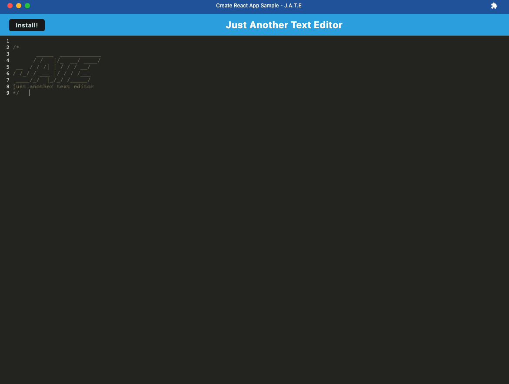
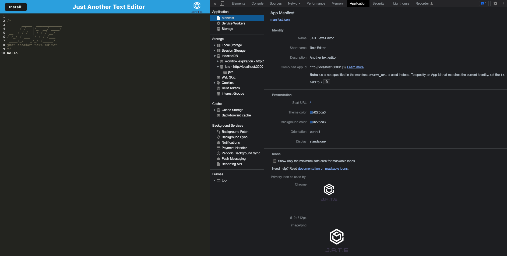
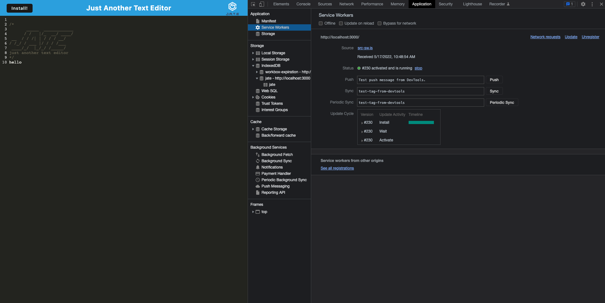
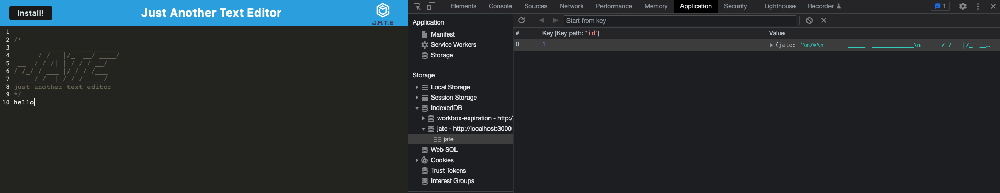

# Text Editor
    
## Description
A text editor web application that can run in the browser or offline and will store the data.

## Table of Contents
* [Installation](#installation)
* [Usage](#usage)
* [Screenshot](#screenshot)
* [License](#license)
* [Questions](#questions)

## Installation
Clone the repository, run "npm install" in the command line and set up dependencies in the root and client directories. Run "npm start" to start the application.

## Usage
The text users type into the application is saved even when they are offline and information is synced once they are online. 

## Screenshot

## License
MIT

## Questions
Email: chindatrate@me.com

GitHub: https://github.com/chindatrate